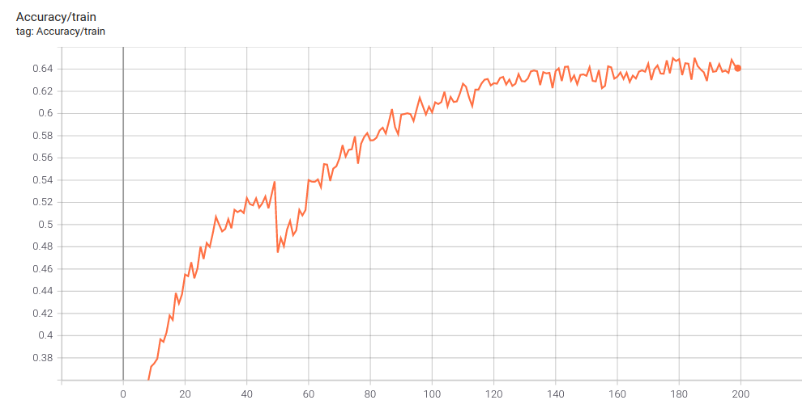
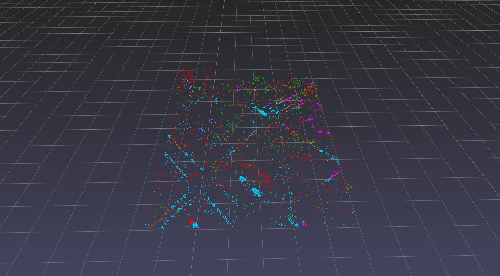

# PointNet2_Segmentation

## Description
This project is based on PointNet++ paper. You can find the [arXiv](https://arxiv.org/abs/1706.02413) version here.
```bash
@article{DBLP:journals/corr/QiYSG17,
  title={PointNet++: Deep Hierarchical Feature Learning on Point Sets in a
               Metric Space},
  author={Charles Ruizhongtai Qi and
               Li Yi and
               Hao Su and
               Leonidas J. Guibas},
  journal={CoRR},
  year={2017}
}
```
pointNet++ is a network that can efficiently perform semantic segmentation using point-wise MLPs on non-uniformly sampled 3D point cloud data. This structure can achieve a high overall performance while keeping a low computational cost.
This code is based on [PointNet++](https://github.com/yanx27/Pointnet_Pointnet2_pytorch)

---
## Usage
### Swiss3DCities
The Dataset can be downloaded from this [link](https://zenodo.org/record/4390295#.YL41YiYo85k). All files are converted to numpy ```.npy``` files.
Each file contains a ```N x F``` matrix, where ```N``` is the number of points in a scene and ```F``` is the number of features per point, in this case ```F=7```.
The features are ```XYZRGBL```, the 3D ```XYZ``` position, the ```RGB``` color and the ground truth semantic label ```L```. 
| Label ID | Semantics  | RGB             | Color       |
|----------|------------|-----------------|-------------|
| 0  | Terrain          | [200, 90, 0]    | brown       |
| 1  | Building         | [255, 0, 0]     | red         |
| 2  | UrbanAsset       | [255, 0, 255]   | pink        |
| 3  | Vegetation       | [0, 220, 0]     | green       |
| 4  | Car              | [0, 200, 255]   | blue        |

### Folder structure

When loading the dataset, the data must be organized as follows:

```plain
└── DATA_DIR
       ├── 01   
       |   ├── Davos_1.npy
       |   ├── Davos_2.npy
       |   └── ...
       └── 02  
       |   ├── Zug_1.npy
       |   ├── Zug_2.npy
       |   └── ...
       └── 03  
       |   ├── Zurich_1.npy
       |   ├── Zurich_2.npy
       |   └── ...
```
#### Train & Evaluate

To train a model for semantic segmentation run ```train_semseg.py``` inside:
```bash
python train_semseg.py  --epoch 200 --batch_size 5 --data_path [DATA_DIR]
```

To evaluate your model after training run ```eval.py``` results will be stored in  ```result``` folder:
```bash
python eval.py --data_path [DATA_DIR]
```
---
## Results
Results are shown for 200 epochs on 4096 sampled points:


